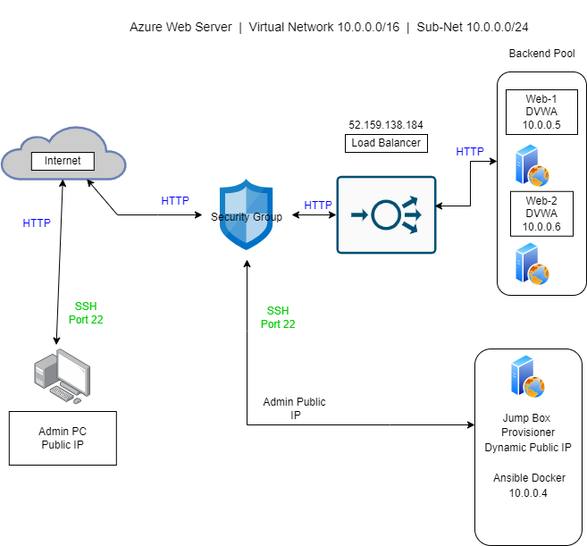
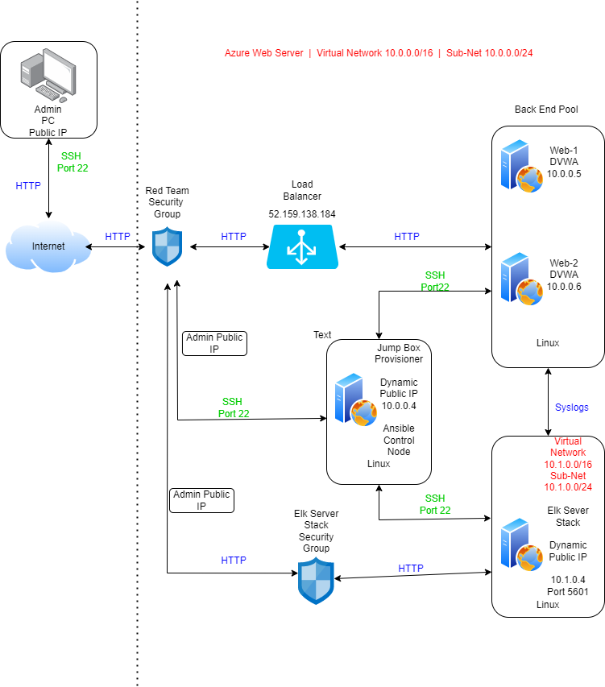
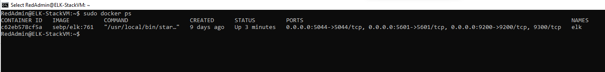

## Automated ELK Stack Deployment

The files in this repository were used to configure the network depicted below.

Initial Server Setup https://github.com/RckBaird0013/First-Azure-Web-Servers/blob/2cefbeac500c21dbec2ba62b0e5cfee4119b1a7c/Diagrams/Initial-Server-Setup.drawio.png

First Azure Web Server https://github.com/RckBaird0013/First-Azure-Web-Servers/blob/2cefbeac500c21dbec2ba62b0e5cfee4119b1a7c/Diagrams/First-Azure-Web-Server.drawio.png

These files have been tested and used to generate a live ELK deployment on Azure. They can be used to either recreate the entire deployment pictured above. Alternatively, select portions of the Ansible files may be used to install only certain pieces of it, such as Filebeat.

[Ansible Directory]

- Pentest.yml
- Install-Elk.yml
- Filebeat-config.yml
- Filebeat-playbook.yml
- Metricbeat-config.yml
- Metricbeat-playbook.yml

This document contains the following details:
- Description of the Topology
- Access Policies
- ELK Configuration
  - Beats in Use
  - Machines Being Monitored
- How to Use the Ansible Build

### Description of the Topology

The main purpose of this network is to expose a load-balanced and monitored instance of DVWA, the D*mn Vulnerable Web Application.

Load balancing ensures that the application will be highly available, in addition to restricting access to the network. Load Balancers manage the flow of traffic to a backend server group. This ensure that the information is 
easily accessable but that the servers are not expose to the internet directly. Load balancers also add to the defense in depth concept of Cyber Security. Load balancers help reduce downtime, offer scalability, allow redundancy along
with flexiblilty and efficiency to a network. A Load Balancer can help prevent single points of failure and reduce attack service and help mitigate issues like DDoS attacks against a server by only allowing verified users to access the
resources requested.

In this environment we are using a jump box to easily access our DVWA servers as well as our Elk Stack Server. A jump box can easily help us setup, maintain and preform updates on our servers. Our JumpBoxProvisioner will only allow
specified users, through rules within the Network Security Group, to access the back end pool server which helps to harden our enviornment against intursion. 

Integrating an ELK server allows users to easily monitor the vulnerable VMs for changes to the network and system configuration.
We have choosen to use Filebeat to watches for log files or locations that an administrator can specify and enables the collection of log events and sends them to Elasticsearch or Logstash for indexing. These events can later be examed
and research should an administrator suspect a potential breach or after a confirmed breach to identify the vulnerablities that lead to the breach.
We have also choosen to use Metricbeat to record metrics and other statistics and deliver them to Elasticsearch or Logstash to be examined. Basic information can be found within these logs as well as specific information as to a 
potential adversary information such as geo locations and high traffic countries as well as amount of users during a specific time frame and even help us see what Operating Service the device may be using to access the servers. 

The configuration details of each machine may be found below

| Name         | Function      | IP Address | Operating System |
|--------------|---------------|------------|------------------|
| Jump Box     | Gateway       | 10.0.0.4   | Ubuntu 18.02     |
| Web-1        | DVWA          | 10.0.0.5   | Ubuntu 18.02     |
| Web-2        | DVWA          | 10.0.0.6   | Ubuntu 18.02     |
| Elk-Stack VM | Elk Container | 10.1.0.4   | Ubuntu 18.02     |

### Access Policies

In this enviornment the machines on the internal network are not exposed to the public Internet. 

Only the JumpBoxProvisioner machine can accept connections from the Internet. Access to this machine is only allowed from the following IP addresses:
-Local Admin Public IP

Machines within the network can only be accessed by The JumpBoxProvisioner Dynamic IP Address.
The Jump Box is also granted access to the Elk-Stack VM 
The IP of the Elk-Stack VM is 10.1.0.4

A summary of the access policies in place can be found in the table below.

| Name         | Publicly Accessible | Allowed IP Addresses  |
|--------------|---------------------|-----------------------|
| Jump Box     | Yes                 | Admin Public IP       |
| Web-1        | No                  | 10.0.0.4              |
| Web-2        | No                  | 10.0.0.4              |
| Elk-Stack VM | No                  | 10.0.0.4              |

### Elk Configuration

Ansible was used to automate configuration of the ELK machine. No configuration was performed manually, which is advantageous because after initial setup the Elk Machine and Web Servers can be maintained without much effort 
through the ansible container. This low maintanence allows an administator more time to scan and monitor the system versus manually configuring the Elk Machine and Web servers. It can also save on cost of the server operation.

[Install-Elk]

- Initial section specifies ELK host and authorized remote users
- Tasks 1-3 - Installs the docker.io, python3 package management system and Docker onto the VM
- Tasks 4-6 - Specifies and increases the memory of the Virtual Machine and allows the changes even upon restart 
- Task  7   - Downloads the specific Docker container to be installed and begins launch. This also specifies the ports ELK will run on.  
- Task  8   - Allows Docker to be enable any time the machine is booted up. 

[filebeat-playbook]

- Intial section specifies webserver hosts and authorized remote users
- Tasks 1-3 - Specifiy what file is to be downloaded, to depackage the file once downloaded and where to store the file
- Task  4    - Enable Filebeat on the VM
- Tasks 5-6  - Allows the setup and startup of the Filebeat service
- Task  7    - Enable Filebeat service on Boot

[metricbeat-playbook]

- Intial section specifies webserver hosts and authorized remote users
- Tasks 1-3 - Specifiy what file is to be downloaded, to depackage the file once downloaded and where to store the file
- Task  4    - Enable Metricbeat on the VM
- Tasks 5-6  - Allows the setup and startup of the Metricbeat service
- Task  7    - Enable Metricbeat service on boot

The following screenshot displays the result of running `docker ps` after successfully configuring the ELK instance.

Elk Install Verification https://github.com/RckBaird0013/First-Azure-Web-Servers/blob/2cefbeac500c21dbec2ba62b0e5cfee4119b1a7c/Images/Elk-Install-Verification.png

### Target Machines & Beats
This ELK server is configured to monitor the following machines:

|  Name  |  IP Address  |
|--------|--------------|  
|  Web-1 |  10.0.0.5    |
|  Web-2 |  10.0.0.6    |

Metricbeat and Filebeat have been installed to monitor and send information such as logs, metric and statistics from the Web 1 and 2 servers.

Metricbeat and Filebeat have been successfully installed.

These Beats allow us to collect the following information from each machine:

Filebeat helps to gather log files or locations as specified by an administrator and sends them of to Elasticsearch to be anaylized further for any potential breaches. This is very help during and even after a breach has
taken place. Filebeat can even use Heartbeat to show uptime information of the servers.
Metricbeat gathers statistics and along with other metrics on thing such as amount of unique users at a given time. It can show hot spots of traffic coming from different regions and can sometimes offer geo locations to 
users or adversaries. Both Beats offer invaluable tools for helping to maintain and secure a cloud enviornment such as this 

### Using the Playbook

[file playbook]
what metric and file beats configure

In order to use the playbook, you will need to have an Ansible control node already configured. Assuming you have such a control node provisioned: 

SSH into the control node and follow the steps below:
- Copy the filebeat-config.yml and metricbeat-config.yml files to etc/ansible/roles directory within the jump box provisioner.
- Update the config files to include the [webserver] server private IP addresses
- Run the playbook, and navigate to http://<public ip>:5601/app/kibana to check that the installation worked as expected.

Copy filebeat-playbook.yml, metricbeat-playbook.yml and pentest.yml to the /etc/ansible/roles directory within the Jump Box.
Host file in the ansible directory must be updated to [webservers] 10.0.0.5 and 10.0.0.6. [Elk] 10.1.0.4. Each playbook already specifies which server is being configure on the host line of the YAML Script.
Navigate to http://<public ip>:5601/kibana/app to verify Elk Server is running.

The following commands allow a user to update and push files to the specified GitHub. 

- git add
- git config --global user name (if needed)
- git commit -m "First commit"
- git push 
